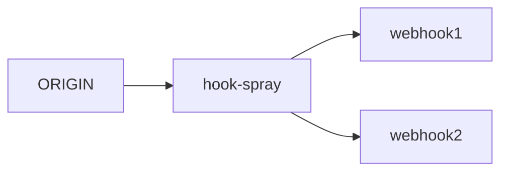

# hook-spray
Webhook notification proxy to dispatch to multiple endpoints.
This also works for SPARQL 1.1 Update.
`hook-spray` endpoint is fixed to `/hook`.



This webhook proxy is quick to setup but not robust.
If you want robustness, there is kafka-backed job queue dispatcher.

https://github.com/simonireilly/kafka-webhook-dispatcher

## args

- dest : webhook endpoint. you can set multiple times.
- port : hook-spray listening address. (default=`:8080`)

Example:

```bash
hook-spray -port=:8080 -dest=http://webhook1 -dest=http://webhook2
```


